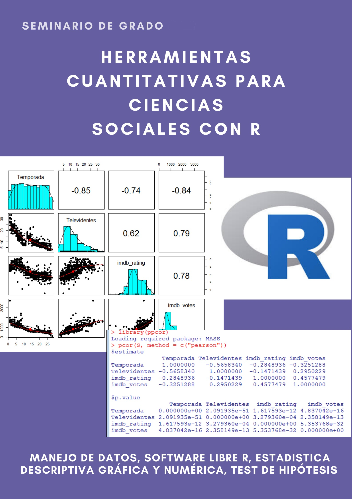

## Docencia

Me desempeño como docente en cursos de grado y posgrado en arqueología y antropología, con énfasis en métodos cuantitativos, teoría evolutiva y análisis estadístico aplicado.

{width=50%}

### Cursos de grado

- *Métodos cuantitativos en Arqueología*. Facultad de Filosofía y Letras, Universidad de Buenos Aires (UBA).  
- *Elementos de Antropología y Arqueología Evolutiva*. Facultad de Filosofía y Letras, Universidad de Buenos Aires (UBA).  

### Seminarios de grado

- *Herramientas cuantitativas para ciencias sociales con R*. Facultad de Filosofía y Letras, Universidad de Buenos Aires (UBA).  

### Posgrado

- *Métodos 1 (Métodos Cuantitativos)*. Curso de Magíster del programa de posgrado en Antropología, Universidad de Tarapacá, Arica, Chile.

---

## Teaching

I teach undergraduate and graduate courses in archaeology and anthropology, with a focus on quantitative methods, evolutionary theory, and applied statistical analysis.

### Undergraduate courses

- *Quantitative Methods in Archaeology*. Faculty of Philosophy and Letters, University of Buenos Aires (UBA).  
- *Elements of Evolutionary Anthropology and Archaeology*. Faculty of Philosophy and Letters, University of Buenos Aires (UBA).  

### Undergraduate seminars

- *Quantitative Tools for Social Sciences with R*. Faculty of Philosophy and Letters, University of Buenos Aires (UBA).  

### Graduate teaching

- *Methods 1 (Quantitative Methods)*. Master’s Program in Anthropology, University of Tarapacá, Arica, Chile.