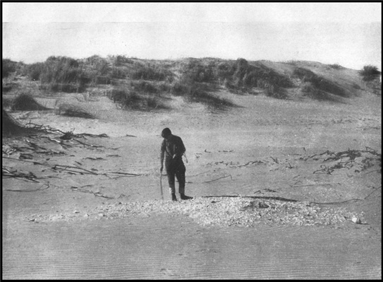

{width=60%}

La costa norpatagónica del Atlántico (Golfo San Matías, Río Negro, Argentina) es una región de gran riqueza arqueológica que se extiende a lo largo de 380 km y presenta evidencias de adaptaciones humanas tempranas a la explotación de recursos marinos. Los primeros estudios, realizados por el Dr. Bórmida en las décadas de 1960 dentro del marco histórico-cultural, se centraron principalmente en materiales líticos de superficie para definir “industrias” y reconstruir secuencias prehistóricas de aproximadamente 6.000 años.

Tras varias décadas sin investigaciones, lo que generó un vacío de información, nuestro equipo de investigación trabaja de manera continua en esta región desde 2004, con un enfoque en las adaptaciones costeras. Nuestra aproximación integra estudios distribucionales y tecnológicos, análisis paleoambientales, isotópicos y zooarqueológicos, junto con la construcción de un marco cronológico sólido. Estos trabajos han permitido revisar de manera sustancial la visión tradicional de los cazadores-recolectores patagónicos, aportando evidencia robusta sobre la existencia de grupos costeros que explotaban recursos marinos y terrestres al menos desde fines del Holoceno medio.

{width=50%}

--------

The North Atlantic Patagonian Coast (San Matías Gulf, Río Negro, Argentina) is an archaeologically rich region extending over 380 km, with evidence of early human adaptation to marine resources. Initial studies conducted by Dr. Bórmida in the 1960s, within the Culture-Historical framework, focused mainly on surface lithic materials to define industries and reconstruct prehistoric sequences spanning approximately 6,000 years.

After several decades without research, creating a significant information gap, our research team has been working continuously in this region since 2004, focusing on coastal adaptations. Our approach integrates distributional and lithic analyses, paleoenvironmental and isotopic studies, zooarchaeology, and the development of a robust chronological framework. These investigations have significantly revised traditional views of Patagonian hunter-gatherers, providing strong evidence for the presence of coastal groups exploiting both terrestrial and marine resources, at least since the end of the Middle Holocene.

{width=50%}

