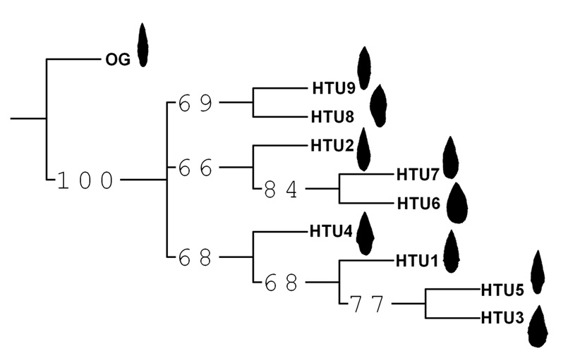
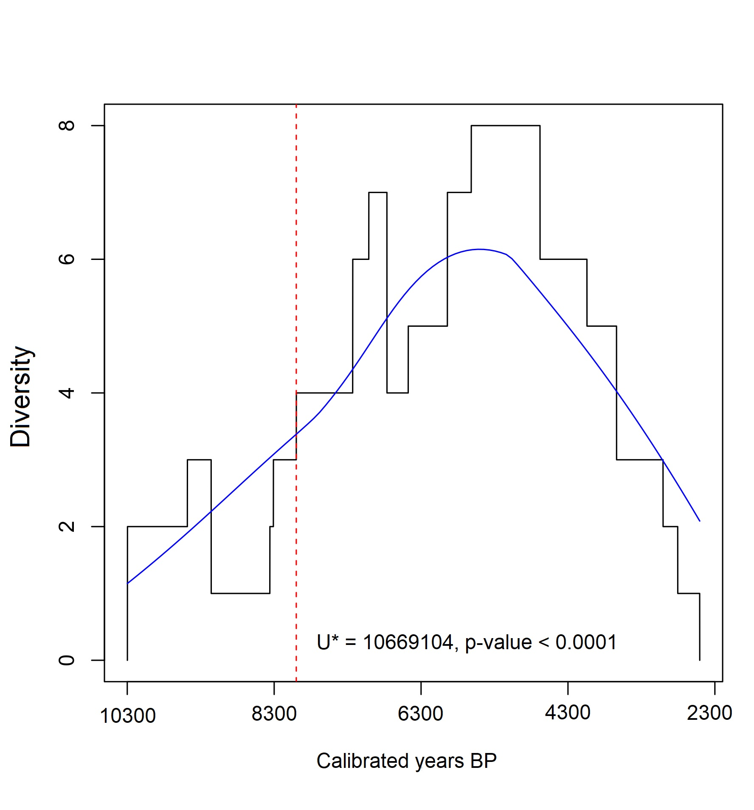

{width=50%}

En esta linea de investigacion que sesarrolamos junto a distintos colegas explora el estudio de patrones evolutivos mediante herramientas metodológicas derivadas de la estadística multivariada,  herramientas filogenéticas y el empleo de modelos evolutivos. Lo que posibilita analizar dinámicas de diversificación y transformación tecnológica desde una perspectiva explícitamente evolutiva.

{width=50%}
----------

In this line of research, which we have developed in collaboration with various colleagues, we explore the study of evolutionary patterns using methodological tools derived from multivariate statistics, phylogenetic approaches, and evolutionary models. This framework enables the analysis of technological diversification and transformation dynamics from an explicitly evolutionary perspective.

{width=50%}

