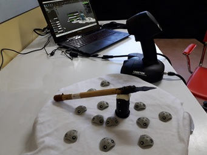
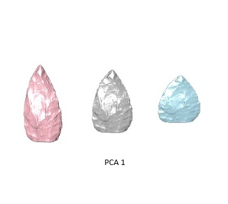

{width=60%}
Este proyecto investiga la variabilidad métrica y morfológica de las puntas de proyectil de Fuego-Patagonia con el objetivo de inferir su función y reconstruir sus trayectorias de vida, mediante un enfoque integrador que combina estudios experimentales, modelado morfométrico y análisis estadísticos. En primer lugar, se desarrollan programas experimentales basados en la replicación de puntas líticas y su uso controlado mediante propulsor, lo que permite registrar de manera longitudinal los procesos de daño, fractura, mantenimiento y reactivación, generando datos empíricos sobre patrones de macrofractura y cambios alométricos asociados al uso. En segundo lugar, se emplean técnicas de modelado 2D y 3D mediante fotogrametría y morfometría geométrica, que posibilitan cuantificar con alta precisión las variaciones de forma y tamaño a lo largo de la secuencia de manufactura y uso, capturando aspectos complejos de la morfología no accesibles a través de medidas lineales tradicionales. Finalmente, estos datos son integrados mediante análisis estadísticos multivariados y modelos discriminantes, con el fin de identificar variables morfo-funcionales clave, diferenciar sistemas de armas (flechas, dardos, lanzas) y construir modelos predictivos aplicables al registro arqueológico. En conjunto, el proyecto propone que la forma de las puntas resulta de la interacción entre restricciones funcionales y procesos de historia de vida, y busca desarrollar un marco cuantitativo robusto que permita explicar la variabilidad observada y mejorar la inferencia funcional en contextos arqueológicos.

{width=50%}
----------

This project investigates the metric and morphological variability of projectile points from Fuego-Patagonia in order to infer their function and reconstruct their life histories, through an integrative approach that combines experimental studies, geometric morphmetrics, and statistical analysis. First, it develops controlled experimental programs based on the replication of lithic points and their use with spear-throwers, allowing the longitudinal recording of damage, fracture, maintenance, and resharpening processes, and generating empirical data on diagnostic fracture patterns and allometric changes associated with use. Second, it employs 2D and 3D modeling and geometric morphometrics, enabling precise quantification of shape and size variation throughout manufacturing and use sequences, and capturing complex morphological features beyond traditional linear measurements. Finally, these datasets are integrated using multivariate statistics and discriminant models to identify key morpho-functional variables, differentiate weapon systems (arrows, darts, spears), and build predictive frameworks applicable to the archaeological record. Overall, the project argues that projectile point morphology reflects the interaction between functional constraints and life history processes, and aims to develop a robust quantitative framework to explain observed variability and improve functional inference in archaeology.

{width=50%}

